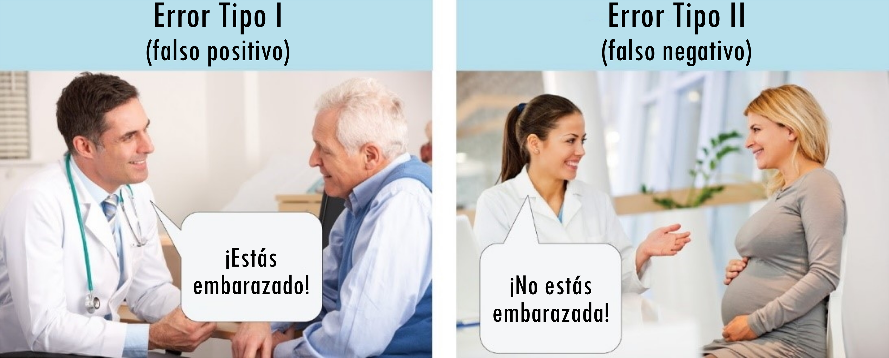

## En una frase

Cuando un estudio concluye que hay un efecto que en realidad no existe, comete un **error Tipo I** (falso positivo). Cuando no logra detectar un efecto que sí existe, comete un **error Tipo II** (falso negativo). Ambos tipos de error son inevitables, pero sus probabilidades pueden controlarse con un buen diseño de investigación.

## Un poco más de detalle

En estadística inferencial, el objetivo habitual es decidir si los datos son compatibles con la hipótesis de que no hay ningún efecto (la *hipótesis nula*, H₀). Esa decisión puede salir mal de dos formas distintas:

| | H₀ es verdadera (no hay efecto real) | H₀ es falsa (sí hay efecto real) |
|---|---|---|
| **Concluimos que hay efecto** | ❌ Error Tipo I | ✅ Decisión correcta |
| **Concluimos que no hay efecto** | ✅ Decisión correcta | ❌ Error Tipo II |

- **Error Tipo I (α):** Rechazamos la hipótesis nula cuando en realidad era verdadera. Es un falso positivo: "encontramos" algo que no existe. La probabilidad de cometerlo se controla con el nivel de significancia, que por convención se fija en α = 0.05 (es decir, aceptamos un 5% de probabilidad de equivocarnos en esta dirección).

- **Error Tipo II (β):** No rechazamos la hipótesis nula cuando en realidad era falsa. Es un falso negativo: pasamos por alto algo que sí existe. Su probabilidad depende del [poder estadístico](../poder-estadistico/index.qmd) del estudio: β = 1 − poder. Un estudio con poder del 80% tiene una probabilidad del 20% de cometer un error Tipo II.

## Un ejemplo

Imagina que un equipo evalúa si un nuevo método de enseñanza mejora el rendimiento académico.

- Si el método **no funciona** pero el estudio concluye que sí lo hace (quizás por azar, o por [*p*-hacking](../p-hacking/index.qmd)), habrá cometido un **error Tipo I**. El colegio podría adoptar un método inútil.

- Si el método **sí funciona** pero el estudio no lo detecta (quizás porque la muestra era demasiado pequeña), habrá cometido un **error Tipo II**. Un método útil quedará descartado.

## El dilema entre los dos tipos de error

Reducir la probabilidad de un tipo de error tiende a aumentar la del otro, si el tamaño de muestra se mantiene fijo:

- Ser más exigente para declarar un resultado significativo (bajar α de 0.05 a 0.01) reduce los errores Tipo I, pero hace más difícil detectar efectos reales, aumentando los errores Tipo II.
- Ser más permisivo (subir α) facilita detectar efectos, pero también aumenta los falsos positivos.

La única forma de reducir ambos simultáneamente es **aumentar el tamaño de muestra**, lo que incrementa el [poder estadístico](../poder-estadistico/index.qmd) sin sacrificar el control sobre los falsos positivos.

## ¿Por qué importa?

La literatura científica tiene un problema asimétrico con estos dos errores. El umbral convencional α = 0.05 fija explícitamente cuántos falsos positivos toleramos, pero el poder estadístico —que controla los falsos negativos— a menudo se ignora al diseñar los estudios.

El resultado es una ciencia con demasiados errores Tipo I (efectos que no se replican) y demasiados errores Tipo II silenciosos (estudios que no detectan efectos reales y simplemente no se publican, contribuyendo al [sesgo de publicación](../sesgo-de-publicacion/index.qmd)). Prácticas como el [pre-registro](../prerregistro/index.qmd) y los [reportes registrados](../reportes-registrados/index.qmd) ayudan a hacer explícitas estas decisiones antes de recoger datos.

## Relacionado con

- [Poder estadístico](../poder-estadistico/index.qmd)
- [Pre-registro](../prerregistro/index.qmd)
- [*p*-hacking](../p-hacking/index.qmd)
- [Sesgo de publicación](../sesgo-de-publicacion/index.qmd)
- [Reportes Registrados](../reportes-registrados/index.qmd)
- [HARKing](../harking/index.qmd)
