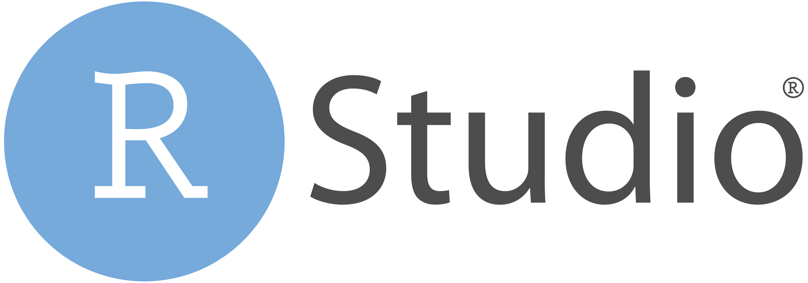

## En una frase

{width="30%"}

R es un lenguaje de programación diseñado especialmente para trabajar con datos, hacer análisis estadísticos y crear gráficos. Es muy usado en investigación, ciencia y empresas para entender información y tomar decisiones basadas en datos. 

Dentro de las funciones de R, se encuentran analizar datos, aplicar estadística y visualizar información. Con él se pueden realizar desde tareas básicas, como promedios o gráficos simples, hasta análisis más complejos como modelos estadísticos, aprendizaje automático o minería de datos. También permite limpiar y organizar grandes bases de datos, automatizar procesos y generar reportes reproducibles. Además, R se puede integrar con herramientas como [Quarto](../quarto/index.qmd) para crear documentos o páginas web dinámicas. De hecho, este sitio web está programado en [Quarto](../quarto/index.qmd) bajo el lenguaje de R, esto permite que su diseño sea sencillo de programar, y que el sitio sea gratuito y fácil de ejecutar.

## ¿Y RStudio? 

{width="30%"}

R es el lenguaje en sí (es decir, el “motor” que hace los cálculos), mientras que RStudio es un programa que facilita su uso, ofreciendo una interfaz amigable donde puedes escribir código, ver resultados, organizar archivos, crear gráficos e insertar imágenes de forma más sencilla. Básicamente, es como ponerle un vestido bonito a R.

## Relacionado con

-   [Análisis reproducibles](../analisis-reproducibles/index.qmd)
-   [Apertura de datos y código](../apertura-datos-codigo/index.qmd)
-   [Ciencia Abierta](../ciencia-abierta/index.qmd)
-   [Quarto](../quarto/index.qmd)
-   [Software libre](../software-libre/index.qmd)
