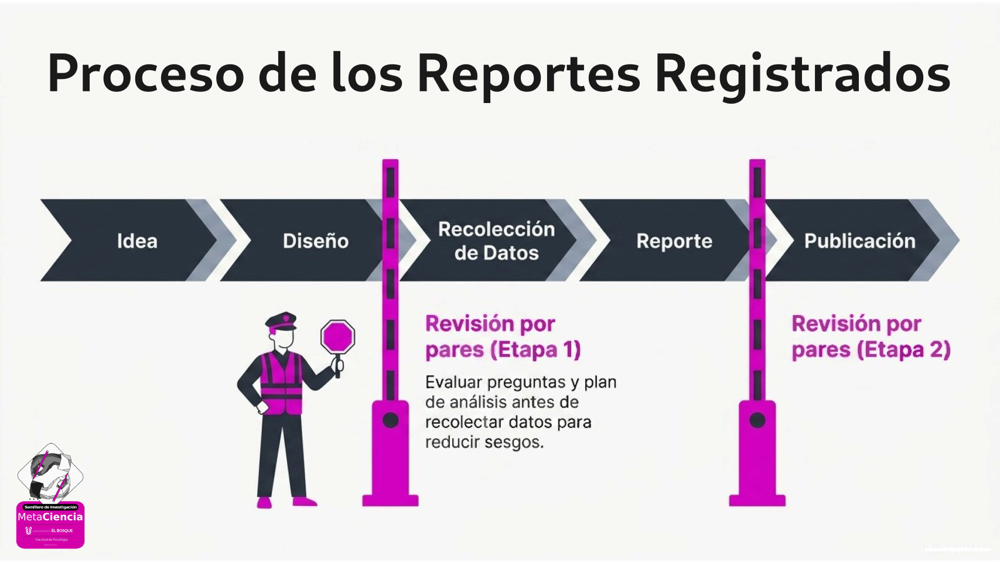

## En una frase
Los Reportes Registrados (*Registered Reports*) son un formato de publicación en el que
la revista evalúa y acepta (o rechaza) el artículo basándose en la calidad de la pregunta
y el diseño del estudio, antes de que existan datos.

## Un poco más de detalle
Mientras que en las publicaciones tradicionales la revisión de pares se hace una vez el
estudio está completo (cuando los datos ya fueron recogidos, analizados e interpretados),
en los Reportes Registrados la revisión más importante ocurre *antes* de que el
investigador tome un solo dato. Esto no solo cambia el momento de la evaluación, sino
también su naturaleza: editores y revisores pueden influir directamente en el diseño del
estudio, sugiriendo mejoras antes de que sea demasiado tarde para implementarlas. La
relación se vuelve así mucho más colaborativa y menos adversarial que en el proceso
tradicional; básicamente, es como tener expertos que te ayudan a mejorar tu diseño en
lugar de juzgar el resultado.

Los Reportes Registrados invierten la lógica tradicional en dos etapas:

1. **Etapa 1:** El autor envía la introducción, hipótesis, método y plan de análisis a la
   revista. Los revisores evalúan la calidad del diseño. Si el estudio está bien
   planteado, la revista otorga una **aceptación en principio** (*in-principle
   acceptance*), un compromiso de publicar el artículo independientemente de los
   resultados.
2. **Etapa 2:** El autor recoge los datos y completa el análisis según el plan aprobado.
   El artículo final se revisa para verificar que los procedimientos se siguieron
   correctamente, y luego se publica.

{width="80%" fig-align="center"}

## ¿Por qué importa?
Este formato ataca directamente varias de las fuentes de sesgo en la ciencia:

- Elimina el [sesgo de publicación](../sesgo-de-publicacion/index.qmd): los resultados
  nulos tienen las mismas probabilidades de publicarse que los positivos.
- Previene el [HARKing](../harking/index.qmd): las hipótesis están fijadas antes de ver
  los datos.
- Reduce el [*p*-hacking](../p-hacking/index.qmd): el plan de análisis es público y fue
  aprobado previamente.

Los estudios muestran que los Reportes Registrados producen proporciones mucho más altas
de resultados nulos que los artículos estándar, lo que sugiere que sí están reduciendo
el sesgo de publicación [@scheelExcessPositiveResults2021; @allenOpenScienceChallenges2019]. 
Por si fuera poco, al pasar por una revisión más rigurosa desde el diseño, 
estos artículos proporcionan resultados más creíbles, y hay evidencia que sugiere que 
tienden a recibir más citas que los trabajos convencionales [@montoyaOpeningDoorRegistered2021].

## ¿Es lo mismo que el pre-registro?
No exactamente. El [pre-registro](../prerregistro/index.qmd) es un compromiso público del
investigador (en una plataforma como [OSF](../osf/index.qmd)), pero no involucra a la
revista. Los Reportes Registrados van un paso más allá: la revista se compromete a
publicar el trabajo antes de que existan resultados.

## Relacionado con

- [Pre-registro](../prerregistro/index.qmd)
- [Sesgo de publicación](../sesgo-de-publicacion/index.qmd)
- [HARKing](../harking/index.qmd)
- [*p*-hacking](../p-hacking/index.qmd)
- [Poder estadístico](../poder-estadistico/index.qmd)
- [Errores Tipo I y Tipo II](../errores_tipo_I_y_II/index.qmd)
- [Ciencia abierta](../ciencia-abierta/index.qmd)
- [OSF](../osf/index.qmd)
